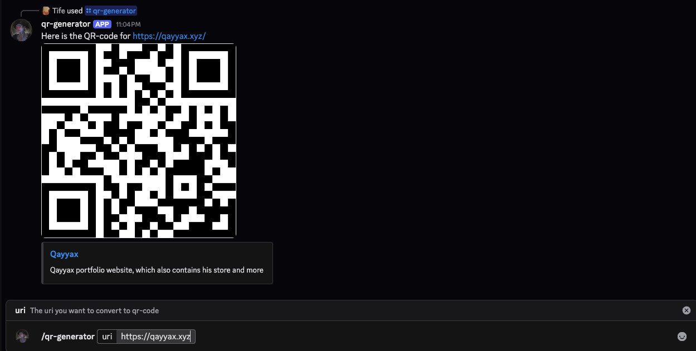

# Discord QR Code Bot (Practice)

This is my practice project for building a Discord bot with slash commands, including a `/qr-generator` command that returns a QR code image.

## What This Bot Does
- `/hello` returns a greeting
- `/anime` returns a random anime suggestion
- `/qr-generator uri:<text>` calls a QR API and sends the generated image back in Discord

## Setup
1. Install dependencies:

```bash
npm install
```

2. Create a `.env` file in the project root:

```env
DISCORD_TOKEN=your_discord_bot_token
CLIENT_ID=your_discord_application_client_id
GUILD_ID=your_discord_server_id_for_testing
```

## Env Details
- `DISCORD_TOKEN`: Bot token from the Discord Developer Portal
- `CLIENT_ID`: Application ID (Client ID) from your Discord app settings
- `GUILD_ID`: The server (guild) ID where slash commands are registered

## Run
```bash
node index.js
```

## Notes
- The QR image is fetched from: `http://api.qrserver.com/v1/create-qr-code/`
- Slash commands are registered as guild commands for faster updates during development.

## Preview

